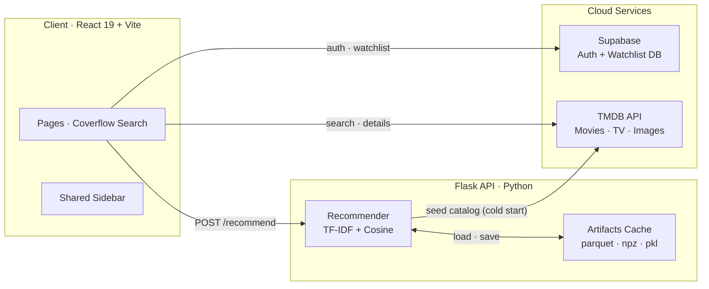
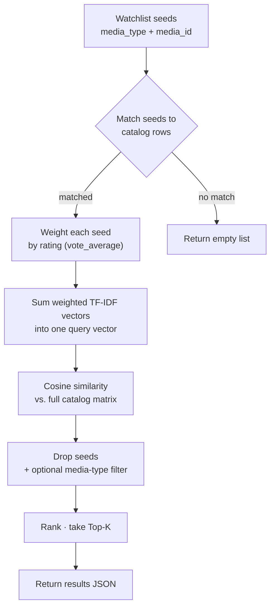
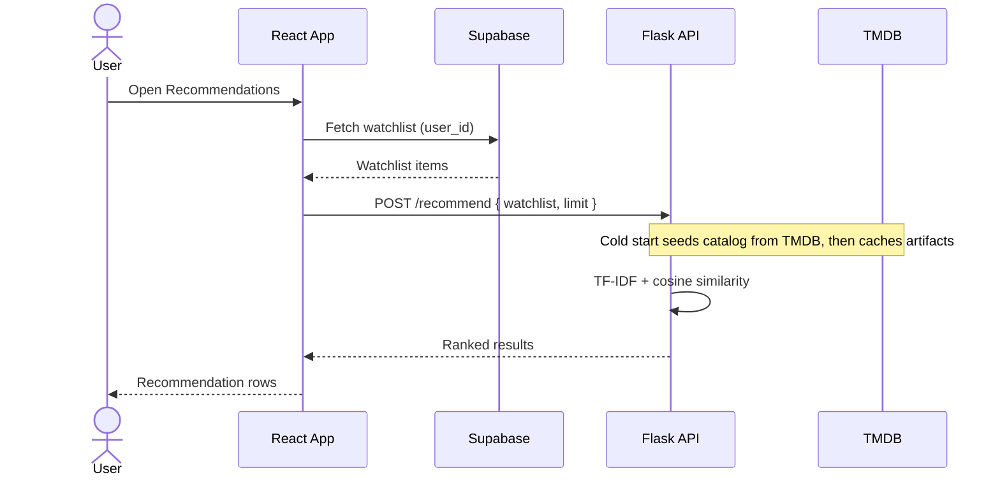
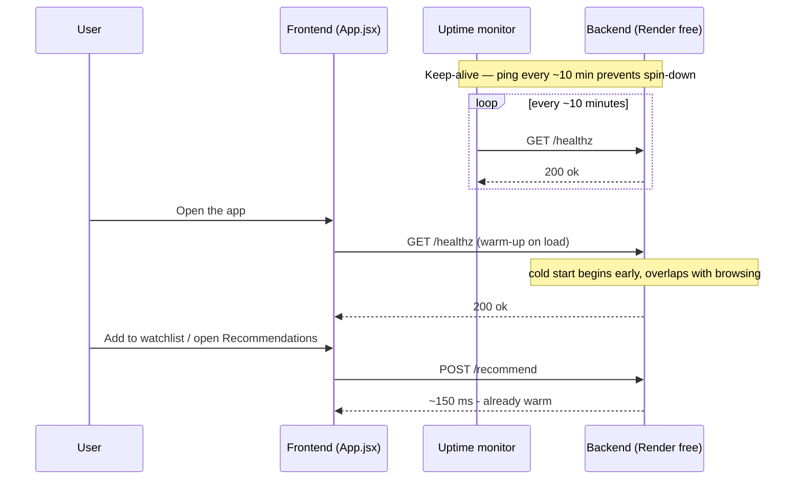
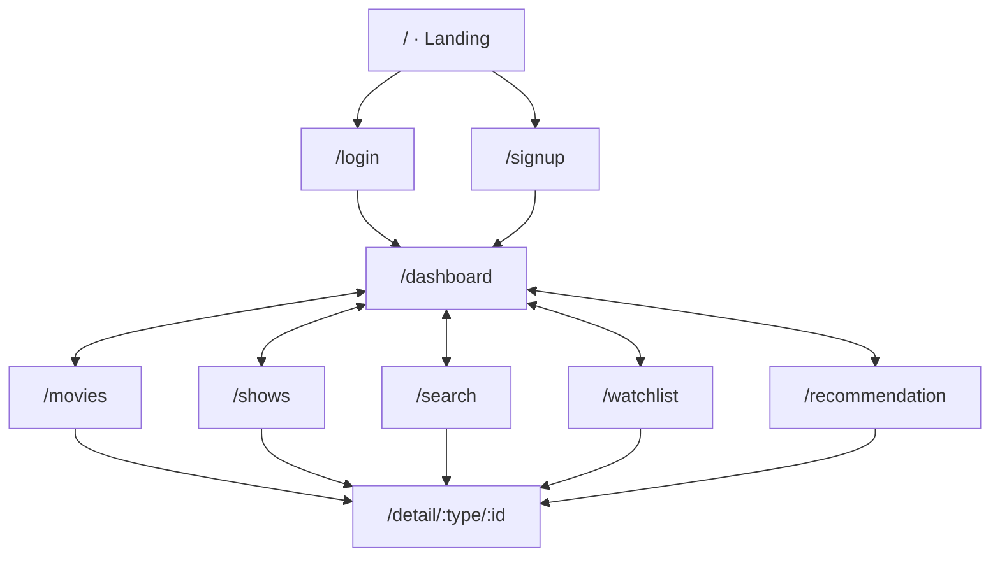

<div align="center">


# CineVision

**A full-stack Movie &amp; TV tracker with AI-powered recommendations and a Liquid-Glass UI.**

<p>
  
  
  
  
  
  
</p>

<p>
  <a href="#overview">Overview</a> ·
  <a href="#features">Features</a> ·
  <a href="#architecture">Architecture</a> ·
  <a href="#recommendation-engine">Recommendation Engine</a> ·
  <a href="#getting-started">Getting Started</a> ·
  <a href="#api-reference">API</a>
</p>

</div>

---

<h2 id="overview"> &nbsp;Overview</h2>

CineVision lets you browse movies and TV shows from **TMDB**, curate a personal watchlist backed by **Supabase**, and receive **content-based recommendations** from a **Flask + scikit-learn** service. The interface is a cohesive *Liquid-Glass* design system: one shared navigation component, a reusable media-card frame, a cinematic video landing screen, and a coverflow search whose blurred backdrop tracks the focused result.

<table>
<tr>
<td><b>Frontend</b></td>
<td>React 19 SPA (Vite) with a token-driven glass design system, framer-motion animations, and full responsiveness.</td>
</tr>
<tr>
<td><b>Backend</b></td>
<td>Flask API that builds a TF-IDF model over a TMDB-seeded catalog and ranks recommendations by cosine similarity.</td>
</tr>
<tr>
<td><b>Data</b></td>
<td>Supabase for auth &amp; watchlist storage; TMDB for movie/TV metadata and imagery.</td>
</tr>
</table>

---

<h2 id="features"> &nbsp;Features</h2>

<table>
<tr>
<td valign="top" width="50%">

** Authentication**
- Secure sign-up / sign-in via Supabase Auth
- Guest (anonymous) sign-in — try it with no account
- Password reset flow with email verification
- Persistent sessions

** Watchlist**
- Add, remove, and organize movies &amp; shows
- Watched status and episode-level progress
- Group by genre, rating, or media type

</td>
<td valign="top" width="50%">

** AI Recommendations**
- TF-IDF (1–2 grams) + cosine similarity
- Signal from title, overview, genres, keywords, cast &amp; creators
- Watchlist seeds weighted by rating
- Artifacts cached to disk, rebuildable on demand

** Design &amp; UX**
- Unified `Sidebar` — identical nav on every page, mobile bottom bar
- Shared media-card frame across all listings
- Coverflow search backdrop that tracks the focused result
- Fully responsive, dark, glassmorphic

</td>
</tr>
</table>

---

<h2 id="architecture"> &nbsp;Architecture</h2>



The React app talks to **TMDB** for metadata, **Supabase** for auth and watchlist persistence, and the **Flask** service for recommendations. On a cold start the recommender seeds its catalog from TMDB and caches the fitted model so subsequent requests are fast.

---

<h2 id="recommendation-engine"> &nbsp;Recommendation Engine</h2>

Content-based filtering over a catalog seeded from TMDB's most popular movies and shows. Each title is turned into a text document (title, overview, genres, keywords, cast, directors/creators), vectorized with TF-IDF, and compared with cosine similarity.



A typical recommendation request end-to-end:



---

<h2 id="keeping-the-backend-awake"> &nbsp;Keeping the Backend Awake</h2>

The backend runs on Render's free tier, which **spins the service down after ~15 minutes of inactivity**. The first request after idle then pays a **cold start** — measured **~67s cold vs. ~0.15s warm**. Two lightweight mechanisms keep recommendations snappy:

- **Warm-up ping** — the frontend fires `GET /healthz` on app load ([`App.jsx`](frontend/src/App.jsx)), so the backend starts waking while the user browses and signs in, instead of blocking their first `POST /recommend`.
- **Keep-alive** — an external uptime monitor pings `/healthz` every ~10 minutes so the service never sleeps, keeping even a first-time visitor's request fast.



**Set up the keep-alive** (free, ~2 minutes):

1. Create a free account at [cron-job.org](https://cron-job.org) (or [UptimeRobot](https://uptimerobot.com)).
2. Add a cronjob → URL `https://cinevision.onrender.com/healthz`, method `GET`, schedule every **10 minutes** (`*/10 * * * *`).
3. Save &amp; enable.

> Render's free web service allows ~750 instance-hours/month — enough to keep one backend awake 24/7 (~720h). The frontend is a static site and doesn't count against that.

---

<h2 id="tech-stack"> &nbsp;Tech Stack</h2>

<div align="center">


<br/>


</div>

| Layer | Technologies |
|-------|--------------|
| **Frontend** | React 19, Vite 7, React Router, Framer Motion, Supabase JS, Axios |
| **Backend** | Python 3.11+, Flask 3, Flask-CORS, Gunicorn |
| **ML / Data** | scikit-learn (TF-IDF, `linear_kernel`), SciPy sparse, pandas, NumPy, PyArrow |
| **Services** | Supabase (Auth + Postgres), TMDB API |
| **Design** | Liquid-Glass tokens, Orbitron · Oxanium · Outfit · Inter |

---

<h2 id="project-structure"> &nbsp;Project Structure</h2>

```
CineVision/
├── frontend/
│   ├── public/                     # Static assets (videos, images, SVGs)
│   ├── src/
│   │   ├── styles/                 # Modular CSS system
│   │   │   ├── design-system.css   # Tokens, resets, utilities, animations
│   │   │   ├── components.css      # Reusable component styles (sidebar, cards…)
│   │   │   ├── layouts.css         # Page layouts (auth, dashboard, detail, intro)
│   │   │   ├── search.css          # Coverflow search page
│   │   │   ├── responsive.css      # All breakpoints (imported last)
│   │   │   └── index.css           # CSS entry point (@imports the above)
│   │   ├── components/
│   │   │   └── Sidebar.jsx          # Shared navigation used by every page
│   │   ├── main.jsx                 # App entry — mounts React & loads global styles
│   │   ├── App.jsx                  # Router & route definitions
│   │   ├── Animations.jsx           # Cinematic landing / intro screen
│   │   ├── DashBoard.jsx            # Home page
│   │   ├── Movies.jsx               # Movies browse
│   │   ├── Shows.jsx                # TV shows browse
│   │   ├── Search.jsx               # Coverflow search
│   │   ├── Detail.jsx               # Movie/show detail
│   │   ├── Watchlist.jsx            # User watchlist
│   │   ├── Recommendation.jsx       # AI recommendations
│   │   ├── Login.jsx · Signup.jsx   # Auth screens
│   │   ├── ForgotPassword.jsx · UpdatePassword.jsx
│   │   ├── Footer.jsx               # Global footer
│   │   └── supabaseClient.js        # Supabase config
│   ├── .env.example
│   └── package.json
│
├── backend/
│   ├── app.py                       # Flask API (healthz · recommend · rebuild)
│   ├── recommender.py               # TF-IDF + cosine recommendation engine
│   ├── requirements.txt             # Python dependencies
│   └── artifacts/                   # Cached model (gitignored)
│
├── .gitignore · LICENSE · README.md
```

---

<h2 id="app-routes"> &nbsp;App Routes</h2>

The landing screen leads to auth; once signed in, the shared sidebar cross-links every core page, and each listing routes into the shared detail view.



---

<h2 id="getting-started"> &nbsp;Getting Started</h2>

**Prerequisites** — Node.js 18+, Python 3.11+, a Supabase project, and a TMDB API key.

**1. Clone**

```bash
git clone https://github.com/NikanEidi/CineVision.git
cd CineVision
```

**2. Frontend**

```bash
cd frontend
npm install
```

Create `frontend/.env`:

```env
VITE_SUPABASE_URL=your_supabase_project_url
VITE_SUPABASE_ANON_KEY=your_supabase_anon_key
VITE_TMDB_API_KEY=your_tmdb_api_key
VITE_API_BASE=http://127.0.0.1:5178
```

```bash
npm run dev
```

> To use **Sign in as Guest**, enable **Anonymous sign-ins** in Supabase under Authentication → Providers.

**3. Backend**

```bash
cd backend
python -m venv venv
source venv/bin/activate        # Windows: venv\Scripts\activate
pip install -r requirements.txt
```

Create `backend/.env`:

```env
TMDB_API_KEY=your_tmdb_api_key
```

```bash
python app.py                   # dev — serves on http://0.0.0.0:5178
# production: gunicorn -w 2 -b 0.0.0.0:5178 app:app
```

**4. Open** — the frontend runs at `http://localhost:5173`.

---

<h2 id="api-reference"> &nbsp;API Reference</h2>

| Method | Endpoint | Description |
|:------:|----------|-------------|
| `GET` | `/healthz` | Health check; ensures the model is loaded/built |
| `POST` | `/recommend` | Ranked recommendations from a watchlist |
| `POST` | `/rebuild` | Clear artifacts and rebuild the catalog from TMDB |

**`POST /recommend`**

```jsonc
// Request
{
  "watchlist": [
    { "media_type": "movie", "media_id": 550 },
    { "media_type": "tv",    "media_id": 1399 }
  ],
  "limit": 20,
  "media_types": ["movie", "tv"]   // optional filter
}
```

```jsonc
// Response
{
  "results": [
    {
      "media_type": "movie",
      "id": 807,
      "title": "Se7en",
      "poster_path": "/6yoghtyTpznpBik8EngEmJskVUO.jpg",
      "vote_average": 8.4,
      "similarity": 0.42,
      "genres": "Crime, Mystery, Thriller"
    }
  ]
}
```

---

<h2 id="design-system"> &nbsp;Design System</h2>

CSS is layered and token-driven; import order is enforced by `index.css`:

```css
@import './design-system.css';  /* Tokens, resets, utilities, animations */
@import './components.css';     /* Reusable components (sidebar, cards…)   */
@import './layouts.css';        /* Page structures (auth, dashboard, intro)*/
@import './search.css';         /* Coverflow search                        */
@import './responsive.css';     /* Breakpoints — MUST be last              */
```

```css
:root {
  /* Color */
  --color-primary: #5F099E;
  --color-accent-cyan: #00E5FF;
  --bg-primary: #0A0A0F;

  /* Glass */
  --glass-bg-medium: rgba(255, 255, 255, 0.08);
  --blur-md: blur(16px);

  /* Typography */
  --font-display: 'Orbitron', 'Outfit', sans-serif;
  --font-heading: 'Oxanium', 'Outfit', sans-serif;
  --font-body: 'Inter', 'Outfit', system-ui, sans-serif;
}
```

---

<h2 id="responsive-breakpoints"> &nbsp;Responsive Breakpoints</h2>

| Breakpoint | Width | Behavior |
|------------|-------|----------|
| Mobile SM | &lt; 480px | Single column, icon-only nav |
| Mobile | 480–599px | Compact cards |
| Mobile LG | 600–767px | Stacked actions |
| Tablet | 768–1023px | Sidebar collapses to bottom bar |
| Tablet LG | 1024–1199px | Sidebar returns |
| Desktop | 1200–1599px | Full layout |
| Desktop XL | 1600px+ | Max content width |

---

<h2 id="changelog"> &nbsp;Changelog</h2>

**v1.1**
- **Unified navigation** — one shared `Sidebar` component; every page renders an identical nav bar and a correct mobile bottom bar.
- **Restored landing screen** — re-added the missing intro styles (video hero, glass sound toggle, Sign In / Sign Up), fully responsive.
- **Search backdrop** — the coverflow's blurred background tracks the focused result with a smooth crossfade over a neutral dark base; tightened vertical spacing.
- **Cleaner pipeline** — global styles imported once from `main.jsx`; changelog-style comments removed; ESLint made JSX-aware.

---

<h2 id="attribution"> &nbsp;Attribution</h2>

This product uses the **TMDB API** but is **not endorsed or certified by TMDB**. Movie and TV data provided by [The Movie Database](https://www.themoviedb.org/).

---

<h2 id="author"> &nbsp;Author</h2>

**Nikan Eidi** — full-stack developer specializing in AI/ML-powered web applications.

<p>
  <a href="https://nikanportfolio.onrender.com"></a>
  <a href="https://github.com/NikanEidi"></a>
</p>

---

<h2 id="license"> &nbsp;License</h2>

Released under the **MIT License** — see [LICENSE](LICENSE) for details.

<div align="center">
<br/>
<a href="#cinevision"> Back to top</a>
</div>
